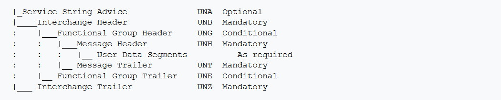
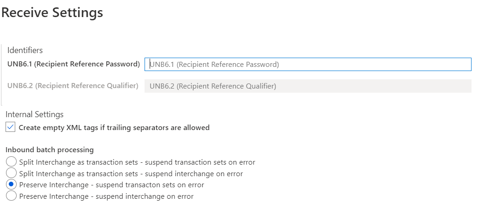
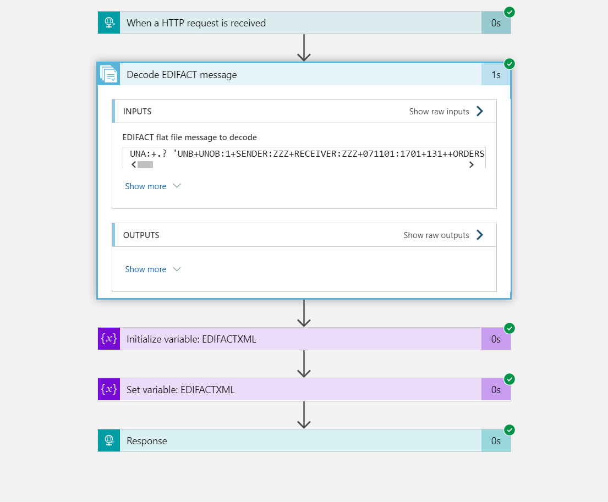
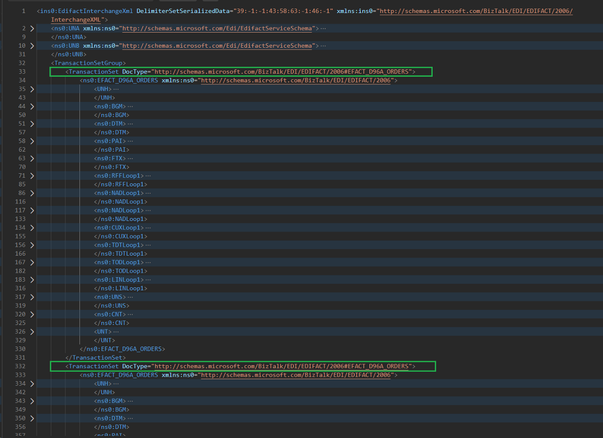
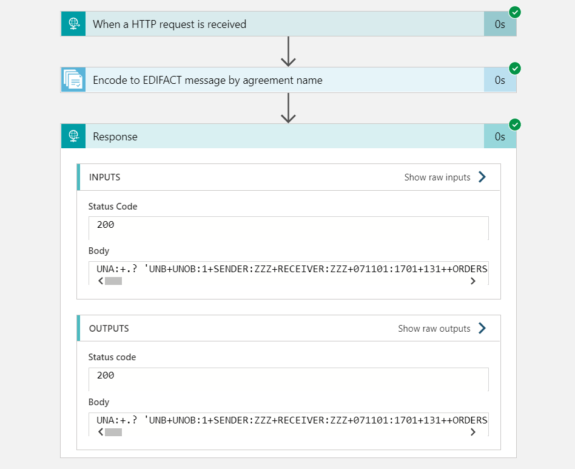

<span style="font-size:larger;">**E**</span>lectronic Data Interchange (EDI) is by far the most commonly agreed format used by trading partners while exchanging data in a business to business interaction. Both Azure integration account and Microsoft BizTalk Server have an excellent EDI support. While BizTalk Server implements EDI capabilities through EDI receive and send pipelines, Encode EDI Message and Decode EDI Message actions in Logic Apps provide similar capabilities to establish an EDI processing channel.
While most of the time, a single EDI document with one transaction is enough to convey the much needed information between business partners, at times a need arises to batch the EDI message exchange. This batched message would consist of multiple EDI transactions (fancy text between UNH - UNT segments, representing one complete message) enclosed within a single Interchange (another set of fancy text between UNA, UNB - UNZ, representing an envelope).



The alternative approach to generate this EDIFACT interchange is quite simple and a three step process
* Schema generation for a batched EDIFACT interchange
* Message construction, with format adhering to step 1.
* EDIFACT encoding of message constructed in step 2, to generate an interchange

### Schema Generation

Now, to generate an schema for a batched EDIFACT interchange, below artifacts are needed
* A sample interchange message, that has the needed EDI segments
* An Integration Account and
* A Logic App with an EDIFACT Decode component and connected to Integration account

Start by creating two parties (representing sending and receiving partners) and a trading partner agreement between these two parties. The trading partner agreement would need the usual configurations, such as the allowed EDI schemas between the two parties, validations ,UNB6 settings etc. But then, considerations are needed for inbound batch processing. It is necessary to avoid splitting the interchange into multiple transaction sets (or messages) and so the option to preserver interchange in the inbound batch processing settings must be selected.



Once these necessary party and agreements settings are done, the sample batched message can be sent to Logic App, which should be able to respond with a XML. XML response generated using expression -``` outputs('Decode_EDIFACT_message')['body']['goodMessages'][0]['payload'] ```



Here is how the XML response from Logic Apps looks. Notice that the entire interchange is represented by element TransactionSetGroup, while individual transactions (or messages) are represented as TransactionSet with elements corresponding to EDI segments.



### Message Construction
Now that the XML structure of the EDIFACT interchange has been generated, use an XSLT or Liquid map to transform the in-house message into this format.
However, do note that with this alternative approach some of data, that would have otherwise been populated by EDI agreement and party settings, are lost. The map would need to populate details under the below EDI segments
* UNA, UNB and UNZ segments for the interchange, and
* UNH and UNT segments for individual transactions.

### EDIFACT Encoding
Another Logic App can be created to generate an EDIFACT interchange, using the Encode to EDIFACT message by agreement name and the constructed XML interchange message.



And that's it. Remember to use the expression - ```decodeBase64(body('Encode_to_EDIFACT_message_by_agreement_name')?['Payload'])``` as the output of EDI Encode shape is usually base64 encoded.

#### References
* https://en.wikipedia.org/wiki/EDIFACT
* https://docs.microsoft.com/en-us/biztalk/core/batching-outgoing-edi-messages
