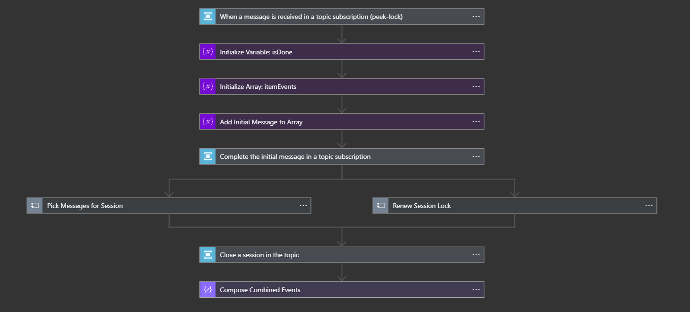
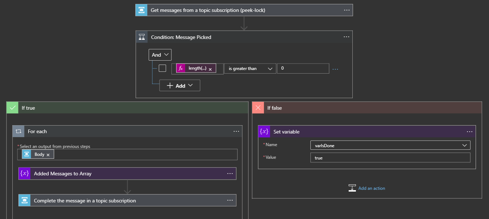
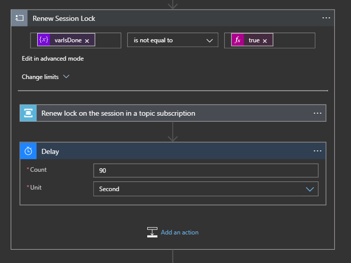

The ever growing need to co-relate thing is never ending. You can never have enough of sources emitting independent events and messages that are in fact related to each other. It's normally not an issue if these events and messages are to be processed individually. However, if the need of the hour is to co-relate these events to make sense of the underlying information, well it's a little bit different.

In the world of BizTalk, it would have taken correlation sets and orchestrations to create a sequential or parallel  convey; it's a little simpler with Logic Apps, well with a few gotchas 😉

We'll need a session enabled Azure Service Bus Queue or Topic and then use Azure Logic Apps - as in BizTalk - to pick up all messages from the service bus with a given session id. As, you've guessed rightly, session id is used as if were the co-relation set.

We begin by using Logic App to pick up an initial message from the service bus. This message would initiate the co-relation and then a set of logic and checks are put into place, to check and pick up all messages from the Service Bus with same session id as that of the initial message.

The below image depicts the overall process flow

Notice the parallel shape following the completion of initial message in the service bus. The branch on the left polls the Service Bus, for messages with same event id as the initial message. When it finds no more messages, pending in the queue, it sets the "isDone" flag to true.

While the sub-flow on the left is picking up the messages, the parallel branch on the right checks if the message pickup is still in progress using the "isDone" flag. While the flag is false, the right sub-flow would renew the lock the message in the Service Bus and introduce a delay of a couple of seconds to let source push pending events (if any) to the service bus.

The renewal of lock on the session, is of at-most importance for the messages with the said session id  to be picked up by the left sub-flow.

That's all folks !