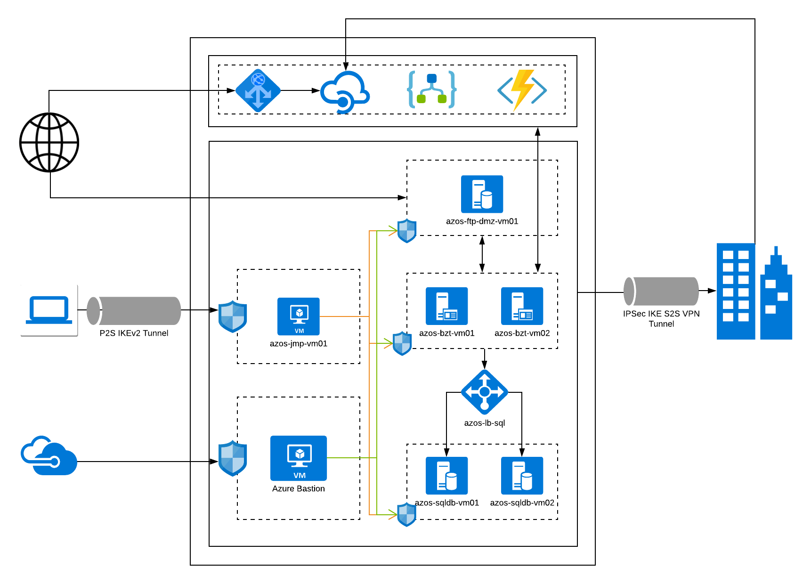

Let's go on a quest ! 

Let's architect a simple hybrid integration environment. We want to swing to "The New", move to "The Cloud" and get going with "The Azure ". Why we want to do this, probably does not any justification anymore. But if it does, let's say that an enterprise is expanding its integration infrastructure and among many things, it wants to

* leverage upon on the pay as you go model, instead of buying more hardware and committing to an upfront cost
* have the best of both world, with servers running on cloud and on-premise network.
* have its integration environment versatile and adaptable to existing on-premise applications, while catering to the more modern applications in the landscape.
* have the new environment compatible with existing integrations, running on on-premise setup

If such an environment were to exist, in the world of Microsoft, what would it consist of ? Well, from the top of my head, I would say, some combination of below core technologies to start with. And of course, it gets some addons, as the integration platform is being prepared to be secure and responsive.

* Microsoft BizTalk Server, which has remained a choice of environment ever since it was introduced in 2000.
* Microsoft Logic Apps, which when coupled with Integration Account and  Azure Functions, is capable of creating amazing workflows. If one is brave enough, this setup can even replace the need of BizTalk server.
* Azure API Management, which can be used to securely expose API end points for consumption by external and internal applications.

My Approach to it, would look something like below.

* We use the BizTalk server on cluster with SQL Server on the load balancer, creating a highly available BizTalk setup. This is needed because the existing infrastructure with BizTalk on-premise has multiple integrations, that we need to retain and provide compatibility with. It can be argued, that these BizTalk integration and their logic can be migrated to Logic Apps. Of course it can be, we are just not doing it yet. Maybe that's the next step.
* Logic Apps, Azure Functions supported by Integration account exists in the setup, however at this stage, they are more to provide the framework for new integrations needs and act as a base for migration of integrations from BizTalk at some point in the future.
* Azure API management has been setup to exchange information securely with internal and external applications over REST endpoints. In addition to it, a FTP/FTPS server has been set up on DMZ, for exchange of files over this old yet highly popular protocol.
* All the VMs  sit securely, even RDP access is accessible only using Azure Bastion or Jump Server. I think Azure Bastion is the future for accessing the servers, but then the single fact that it does not support exchange of files as of today, forces the setup of jump servers. 
* Point to Site tunnel is setup to access the jump server securely and Site to Site tunnel has been setup to access the on-premise network. 

Azure is awesome!  Having worked on it for sometime now, I can attest to it. You are definitely not obliged  to take my word for it. Feel free to explore and do more with Azure.
